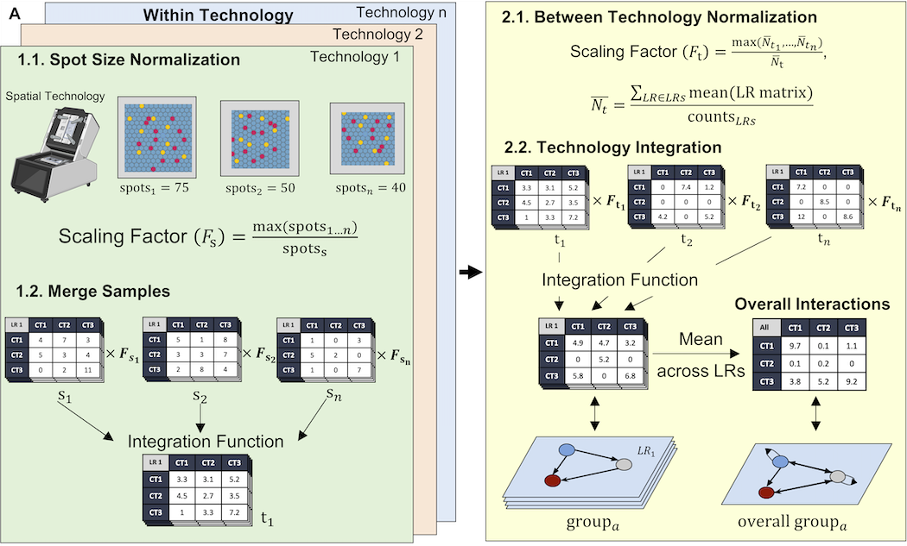
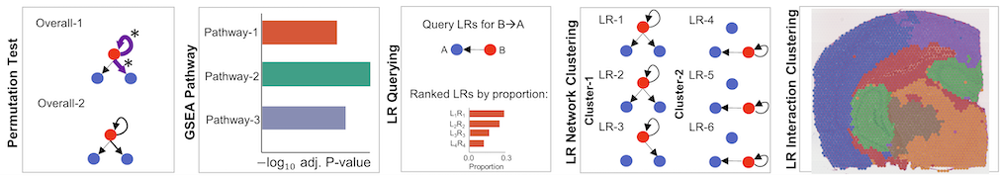
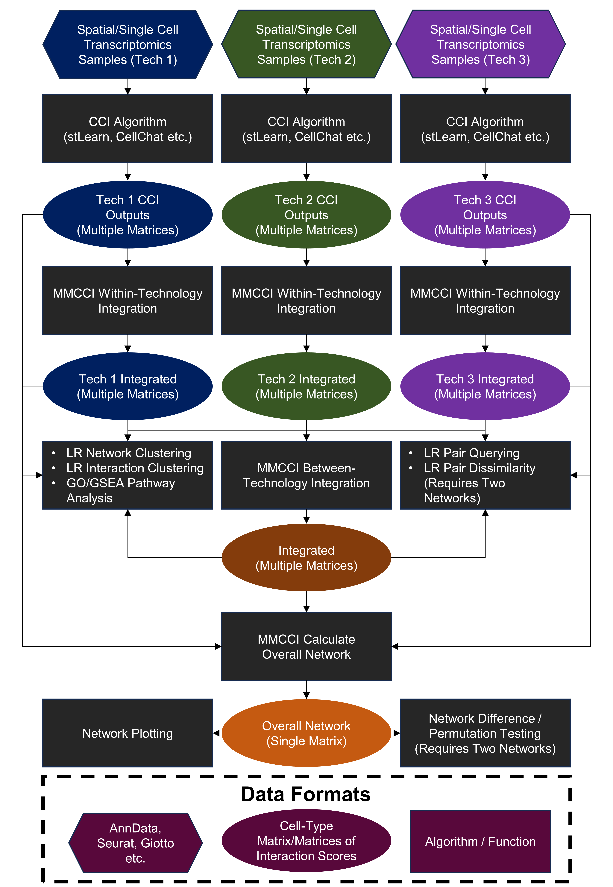

# MMCCI: Multimodal Cell-Cell Interaction Integration, Analysis, and Visualisation

**MMCCI** is a fast and lightweight Python package for integrating and visualizing CCI networks within and between multiple modalities at the level of the individual LR pair. It works on **scRNA-seq** and **spatial transcriptomics** data samples that have been processed through the following CCI algorithms:
1. stLearn
2. CellChat
3. CellPhoneDB
4. NATMI
5. Squidpy

## Getting Started

### Installation

MMCCI can be installed with `pip`

```
pip install multimodal_cci
```


### Documentation

Documentation and Tutorials are available at our **Read the Docs** page (coming soon).

- There is a tutorial notebook [here](examples/brain_aging_example.ipynb)
- To understand how to load CCI results from different tools, look at this notebook [here](example/loading_CCI_results.ipynb)

## CCI Integration

MMCCI allows users to integrate multiple CCI results together, both:
1. Samples from a single modality (eg. Visium)
2. Samples from multiple modalities (eg. Visium, Xenium and CosMX)



## CCI Analysis

MMCCI provides multiple useful analyses that can be run on the integrated networks or from a single sample:
1. Network comparison between groups with permutation testing
2. CLustering of LR pairs with similar networks
3. Clustering of spots/cells with similar interaction scores
4. Sender-receiver LR querying
5. GSEA pathway analysis



### Pipeline Diagram



## Citing MMCCI

If you have used MMCCI in your research, please consider citing us: (coming soon).

